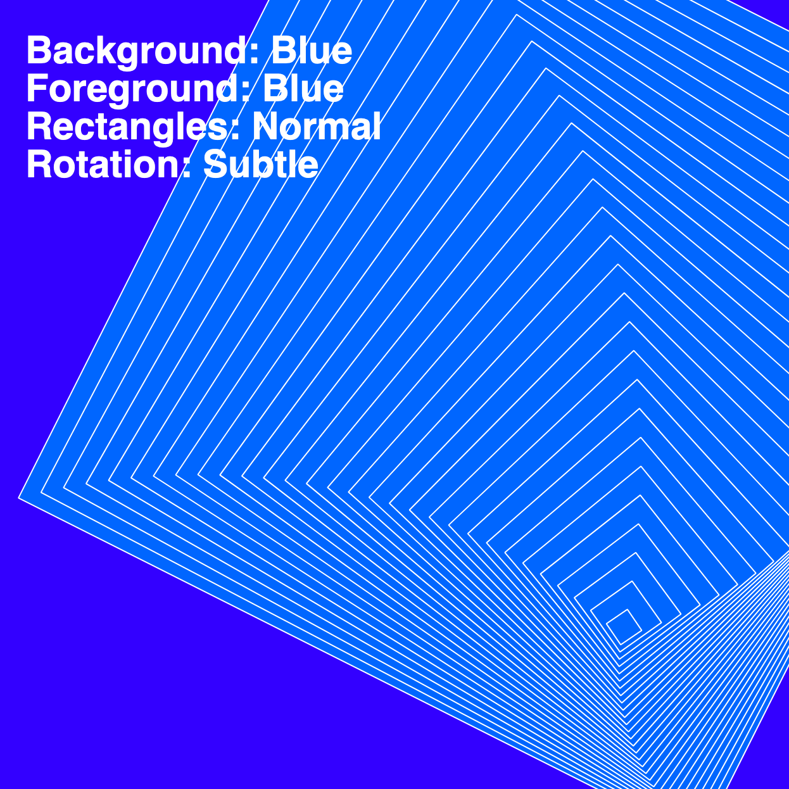

FXHASH + Pts.js starter kit
================

This repo is a fork from ["FXHASH Generative Token webpack boilerplate"](https://github.com/fxhash/fxhash-webpack-boilerplate) with an example use of [Pts.js](https://ptsjs.org) and some utilty functions. We hope this will get you started quickly using Pts.js for generative art projects.

Since fxhash is still in beta, please refer to the original fxhash [repo]((https://github.com/fxhash/fxhash-webpack-boilerplate)) and [website](https://fxhash.xyz) for the latest instructions.

This repo is experimental and may be out-of-sync with fxhash in the future. Please file issues or send a PR to help improve it.

You can also collect the demo included in this repo as a "postcard" on fxhash for 0.1tz [here](https://www.fxhash.xyz/generative/3921). My other fxhah mints are [here](https://www.fxhash.xyz/u/William%20Ngan).



===========================================

README from the [original FXHASH boilerplate](https://github.com/fxhash/fxhash-webpack-boilerplate) (Dec 2021 version)
================

A boilerplate to automate and ease the creation of Generative Tokens on fxhash. This project uses [webpack](https://webpack.js.org/) and [webpack-dev-server](https://github.com/webpack/webpack-dev-server) to improve the development and deployment experience.

Before diving into the development of your token, we recommend reading the [Guide to mint a Generative Token](https://fxhash.xyz/articles/guide-mint-generative-token) to get some understanding of the process.

If you are looking for a simpler boilerplate, you can use the [fxhash simple boilerplate](https://github.com/fxhash/fxhash-simple-boilerplate) instead.


# Scope of this project

* provide a local environment in which you can iterate and use modern features from the javascript ecosystem
* automate the creation of a .zip file ready to be uploaded on fxhash


# How to use

You will need to have [nodejs](https://nodejs.org/) installed.

## Installation

> First, make sure that your node version is >= 14

Clone the repository on your machine and move to the directory
```sh
$ git clone https://github.com/fxhash/fxhash-webpack-boilerplate.git your_folder && cd your_folder
```

Install the packages required for the local environment
```sh
$ npm i
```

## Start local environment

```sh
$ npm start
```

This last command will start a local http server with [live reloading](https://webpack.js.org/configuration/dev-server/#devserverlivereload) enabled so that you can iterate faster on your projects. Open [http://localhost:8080](http://localhost:8080) to see your project in the browser.

## Build

```sh
$ npm run build
```

Will bundle your js dependencies into a single minified `bundle.js` file, move your files from the `public/` to the `dist/` folder, and link the `bundle.js` with the `index.html`.

**Moreover, it will create a `dist-zipped/project.zip` file which can be directly imported on fxhash**.

# Develop your token

Once the environment is started, you can edit the `src/index.js` file to start building your artwork. The `index.html` file is located in the `public/` folder.

You can import libraries using `npm` or by adding the library file in the `public/` folder and link those using relative paths in the `index.html`.

Any file in the `public/` folder will be added to the final project. 

## fxhash snippet

fxhash requires you to use a javascript code snippet so that the platform can inject some code when tokens will be generated from your Generative Token. The code snippet is already in the `index.html` file of this boilerplate, so you don't have to add it yourself.

**During the development stages, the snippet will generate a random hash each time the page is refreshed**. This way, it helps you reproduce the conditions in which your token will be executed on fxhash.

It creates 3 variables:
- `fxhash`: a random 64 characters hexadecimal string. This particular variable will be hardcoded with a static hash when someone mints a token from your GT
- `fxrand()`: a PRNG function that generates deterministic PRN between 0 and 1. **Simply use it instead of Math.random()**.

*The index.js of this boilerplate quickly demonstrates how to use these*.

## How do Generative Tokens work

This is how Generative Tokens work on fxhash:
* you upload your project to the platform (see next section)
* you mint your project
* when a collector will mint its unique token from your Generative Token, a random hash will be hard-coded in the **fxhash code snippet**
* the token will now have its own `index.html` file, with a **static** hash, ensuring its immutability 

The [Guide to mint a Generative Token](https://fxhash.xyz/articles/guide-mint-generative-token) give in-depth details about this process.


# Publish your token

Once you are happy with the results, you can run the following command:

```sh
$ npm run build
```

This will create a `dist-zipped/project.zip` file.

Go to [https://fxhash.xyz/sandbox/](https://fxhash.xyz/sandbox/) and upload the `project.zip` file in there to see if it works properly.

If your token does not work properly, you can iterate easily by updating your files, running `$ npm run build` again, and upload the zip file again.

Finally, you can mint your token using the same `project.zip`file.


# Rules to follow

> Theses rules must be followed to ensure that your token will be future-proof, accepted by fxhash, and behave in the intended way

* the zip file must be under 15 Mb
* any path to a resource must be relative (./path/to/file.ext)
* no external resources allowed, you must put all your resources in the `public/` folder (sub-folders are OK)
* no network calls allowed (but calls to get resources from within your `public/` folder)
* you must handle any viewport size (by implementing a response to the `resize` event of the `window`)
* you **cannot use random number generation without a seed** (the same input hash must always yield the same output). The `fxrand` function does a very good job in that regard.